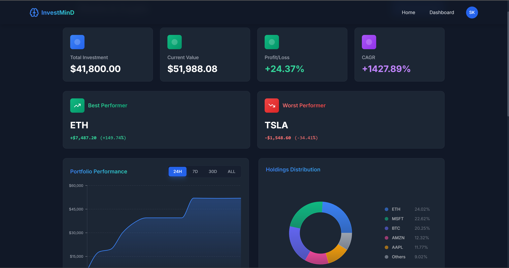

# 🚀 InvestMinD — Smart Investor Portfolio Tracker

[](https://nodejs.org/)
[](https://reactjs.org/)
[](https://www.typescriptlang.org/)
[](https://tailwindcss.com/)
[](https://vercel.com/)
[](./LICENSE)

---

## 🌐 Live Site

🔗 [https://www.investmind.live](https://www.investmind.live)

---

## 📸 Screenshots




---

## 📦 Tech Stack

- **Frontend:** React 18, TypeScript, Vite
- **Styling:** Tailwind CSS, Lucide Icons
- **Charts:** Recharts
- **State Management:** React Context API
- **Animations:** Framer Motion
- **Deployment:** Vercel

---

## 🔑 Features

### 🏠 Landing Page
- Animated Hero section with CTA
- Asset table with mock data filtering
- Testimonials and feature highlights

### 🔐 Auth Flow
- Signup/Login with validations
- OTP-based email verification
- Token-based auto-login

### 📁 Portfolio Management
- Create/delete portfolios
- Sort by investment or P&L%
- Responsive cards with animated stats

### 💼 Holdings
- Add/Delete transactions (Buy/Sell)
- Gain/Loss calculations
- Realtime live prices (via backend API)

### 📈 Visual Analytics
- Time-series performance chart (`24h`, `7d`, `30d`, `All`)
- Donut chart showing stock distribution
- Best/Worst performing stock cards

### 🤖 AI Insight (Gemini API)
- AI summary per asset and full portfolio
- Insight modal with typing effect

### 📤 Excel Export
- One-click export of portfolio holdings

---

## ⚙️ Setup & Development

```bash
# Clone the repo
git clone https://github.com/your-username/investmind-frontend.git
cd investmind-frontend

# Install dependencies
npm install

# Set environment variable
echo "VITE_API_BASE_URL=https://investmind-app-c7irq.ondigitalocean.app" > .env

# Start dev server
npm run dev
```

---

## 🌍 Deployment (Vercel)

1. Push your code to GitHub
2. Go to [vercel.com](https://vercel.com/) → Import Project
3. Set:
   - **Framework**: Vite
   - **Build Command**: `vite build`
   - **Output Dir**: `dist`
   - **Environment Variable**:  
     `VITE_API_BASE_URL=https://investmind-app-c7irq.ondigitalocean.app`
4. Deploy and you're live 🚀

---

## 📝 License

This project is licensed under the MIT License — see the [LICENSE](./LICENSE) file for details.
